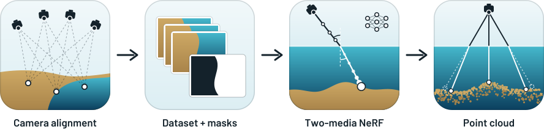

<p align="center">
  <picture>
    <source media="(prefers-color-scheme: dark)" srcset="docs/assets/logo_dark.svg">
    
  </picture>
</p>

<h3 align="center">Refraction-Aware Two-Media Neural Radiance Fields for Bathymetry</h3>

<p align="center">
  
  <a href="https://doi.org/10.5281/zenodo.22986400"></a>
  <a href="https://doi.org/10.48323/G3CAA-ER166"></a>
  <a href="https://docs.nerf.studio/"></a>
  <a href="LICENSE"></a>
</p>

<p align="center"><strong>ISPRS Open Journal of Photogrammetry and Remote Sensing, 2026</strong></p>

<p align="center">
  <picture>
    <source media="(prefers-color-scheme: dark)" srcset="docs/assets/workflow_dark.svg">
    
  </picture>
</p>

<p align="center">
  <strong><a href="https://orcid.org/0009-0002-3620-1974">Markus Brezovsky</a>¹ · Anatol Günthner² · Frederik Schulte³ · Lukas Winiwarter³ · Boris Jutzi² · Gottfried Mandlburger¹</strong>
  <br>
  ¹TU Wien · ²Karlsruhe Institute of Technology (KIT) · ³University of Innsbruck
</p>

<p align="center"><strong>TL;DR:</strong> BathyFacto is a Nerfstudio plugin that traces every camera ray through two media: straight through the air to the water surface, then refracted by Snell's law. On a simulated shipwreck scene it places the seafloor with a signed median deviation of −0.001 m and reaches 85.7 % completeness at 0.2 m, where the baselines without refraction are off by more than a metre.</p>

---

## Documentation

- [Overview](docs/index.md)
- [Installation](docs/installation.md)
- [Dataset format](docs/data.md)
- [Training](docs/training.md)
- [Point-cloud export](docs/export.md)
- [Reproducibility](docs/reproducibility.md)

## Installation

Tested with Python 3.10, torch 2.2.2+cu118, torchvision 0.17.2 and tiny-cuda-nn.

```bash
conda create -n bathyfacto python=3.10 -y && conda activate bathyfacto
pip install torch==2.2.2 torchvision==0.17.2 --index-url https://download.pytorch.org/whl/cu118
pip install "setuptools<81" wheel ninja
pip install --no-build-isolation git+https://github.com/NVlabs/tiny-cuda-nn/#subdirectory=bindings/torch
pip install -e .
python scripts/download_dataset.py
ns-train bathyfacto --data data/simulation-ship
```

Run `ns-train -h` and check that `bathyfacto` appears in the list of methods. See
[docs/installation.md](docs/installation.md) for the full walkthrough.

## Available methods

| Method | Purpose |
|-|-|
| `bathyfacto` | Paper model with two-media refraction (camera optimizer off by default) |
| `nerfacto-bathy-compare` | Nerfacto baseline for the paper comparison |

Ablation without refraction, same method:

```bash
ns-train bathyfacto --pipeline.model.disable-refraction True --data data/simulation-ship
```

## Point-cloud export

```bash
bathyfacto-export --load-config outputs/.../config.yml
```

The exported points are refraction-corrected and written in the global frame of the dataset. See
[docs/export.md](docs/export.md).

## Dataset

`simulation-ship` is a BathyFacto-ready repackaging of the DOI dataset
[10.48323/G3CAA-ER166](https://doi.org/10.48323/G3CAA-ER166):

```bash
python scripts/download_dataset.py
```

For your own Metashape projects, build a compatible dataset with:

```bash
bathyfacto-build-dataset --help
```

See [docs/data.md](docs/data.md) and [DATASET.md](DATASET.md) for the dataset layout and
provenance, and [docs/reproducibility.md](docs/reproducibility.md) for the reference numbers this
release is checked against.

## Citation

```bibtex
@article{brezovsky2026bathyfacto,
  title   = {BathyFacto: Refraction-Aware Two-Media Neural Radiance Fields for Bathymetry},
  author  = {Brezovsky, Markus and G{\"u}nthner, Anatol and Schulte, Frederik and
             Winiwarter, Lukas and Jutzi, Boris and Mandlburger, Gottfried},
  journal = {ISPRS Open Journal of Photogrammetry and Remote Sensing},
  year    = {2026},
  note    = {in press}
}
```

## Acknowledgments

Built on [Nerfstudio](https://docs.nerf.studio/). Funded by the German Research Foundation (DFG, 538522540) and the Austrian Science Fund (FWF, 10.55776/PIN1353223) within the BathyNeRF project.

## License

Apache License 2.0. See [LICENSE](LICENSE) and [NOTICE](NOTICE) for license and upstream
attribution details.
